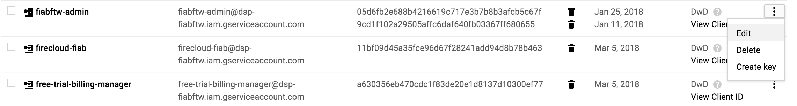
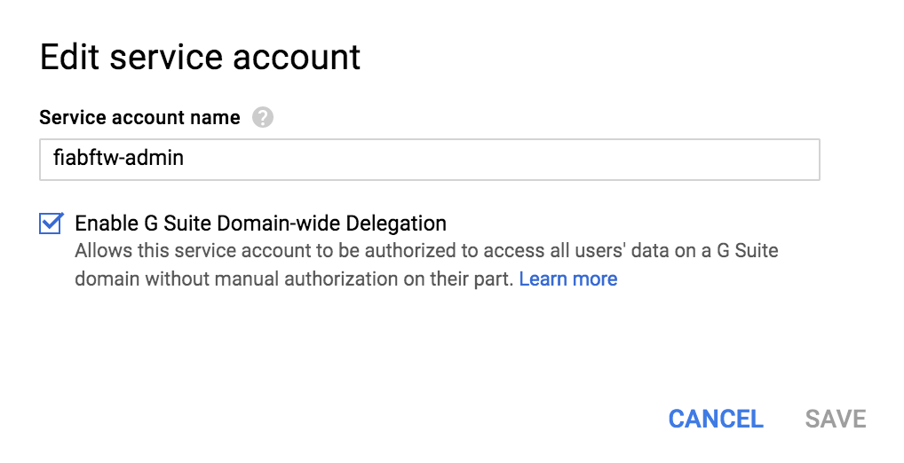
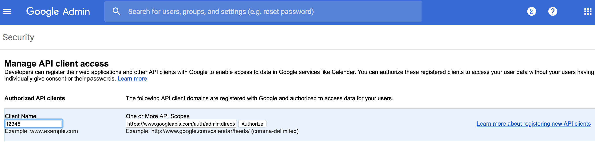
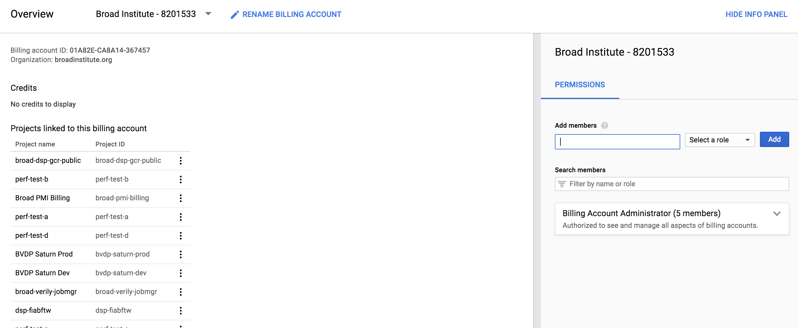

# fiabftw
Firecloud in a Box for the World

## Step 0: Prerequisites

You will need the following software installed on your workspace to run the set up scripts:
- [Docker](https://www.docker.com/community-edition)
- [Vault](https://www.vaultproject.io/downloads.html)
- [gcloud CLI](https://cloud.google.com/sdk/gcloud/)

Other requirements:
- A [Google Project](https://cloud.google.com/resource-manager/docs/creating-managing-projects) (hence referred to as `[google project]`) with a billing account linked to it and the following APIs enabled:
    - Admin SDK
    - Cloud Billing API
    - Google Drive API
    - Google Sheets API
    - Cloud Pub/Sub API
    - Identity and Access Management API
    - Genomics API
    - Cloud Dataproc API
    - Cloud Resource Manager API
- A [GSuite](https://gsuite.google.com/) account (hence referred to as `[google apps domain]`)
- An admin user (hence referred to as `[admin user]`) in the Apps Domain who has also been added to the google project with the "Project Owner" IAM role
- A DNS Domain for the project (hence referred to as `[dns domain]`) 
- SSL Certificates in PEM format with bundle/chain.  A wildcard SSL is preferred.

Authenticate with the gcloud CLI using your admin user:
```
gcloud auth login [admin user]
gcloud config set project [google project]
```

#### Environment variables
The following environment variables will be referenced in the remainder of this documentation: 
- `[google project]` - the name of your google project (i.e. `broad-dsp-fiabftw`)
- `[google apps domain]` - your GSuite account domain (i.e. `fiabftw.firecloud.org`)
- `[admin email]` - an admin account to act as script runner.  Should be in the google apps domain and a Project Owner in the google project.
- `[dns domain]` - the DNS domain with associated SSL certs (i.e. `fiabftw.broadinstitute.org`)
- `[env]` - This is an internal variable that allows for the possibility of standing up multiple fiab "environments" with their own service accounts, groups, and DNS domains.  Will default to a single env, `fiab`.  If you are using the default, this variable does not need to be passed as a parameter to the setup scripts.
- `[vault token]` -  See Step 1 for details.  Will default to reading from `.vault-token-fiabftw` for all scripts. 

## Step 1: Vault

Vault is a secure directory for storing secrets. 

To create a server running vault, run
```
./initialize-vault.sh [google project] [vault host name]
```

Initialize and unseal vault
```
# Set the VAULT_ADDR to point to your vault server
export VAULT_ADDR=http://<GCE IP>:80

# Initialize the server
vault init

# Follow steps to unseal vault
# This should also generate a root token which you store should at ".vault-token-fiabftw" at the root of this project
vault unseal
```

## Step 2: Generate credentials, users, and groups

### Create an acting service account

```
./initialize-script-runner.sh [admin email] [google project]
```
This will create a service account for your admin account, which will be used to authenticate with both GSuite and 
GCloud to run subsequent commands.

##### Manual Step: Enable Domain-wide Delegation 

- [ ] In the console of your google project, go to IAM -> Service Accounts. Find your newly created service 
account (it should have the same name as your admin email).  Click the "more options" button to the right of your service account.


- [ ] Click "edit" and then select "Enable G Suite Domain-wide Delegation."



##### Manual Step: Authorize API scopes

- [ ] In the Admin Console, go to Security -> Advanced settings -> Manage API client access. 
- [ ] From the json of your service account, grab the `client_id`.  Enter it as "Client Name" and enter the following as
 comma-separated API Scopes and then click "Authorize": 
    * https://www.googleapis.com/auth/admin.directory.customer 
    * https://www.googleapis.com/auth/admin.directory.group 
    * https://www.googleapis.com/auth/admin.directory.rolemanagement
    * https://www.googleapis.com/auth/admin.directory.user 


    
### Create service accounts in google project

```
./gce/create-service-accts.sh [google project] [google apps domain] [env]
```
This will create service accounts for all firecloud services and give them the appropriate IAM roles in GCloud.
It will also generate a text file, `service-accts.txt`, which will be used in the following step to add the service
accounts to groups in GSuite. 

**Manual Step**: Give the following services accounts [Domain-wide Delegation](#manual-step-enable-domain-wide-delegation): agora, billing, firecloud, free-trial-billing-manager, leonardo, rawls, and sam.

**Manual Step**: [Create Oauth Credentials](./oauth/OauthCreds.md).

### Create groups and users in GSuite

```
# NOTE: [password] is a default password for the users who will be created in your apps domain
# NOTE: [admin email] must be in the apps domain 
./google-apps-domain/initialize-users-and-groups.sh [google apps domain] [admin email] [google project] [password] [env]
```

This will create the initial Firecloud groups and users, and add users and service accounts to groups.

**Manual Step**: [Add scopes](#manual-step-authorize-api-scopes) to the following services accounts in the Admin Console (remember that you have to use the service account `client_id` as the Client Name):

service | scopes
--- | ---
agora | https://www.googleapis.com/auth/admin.directory.group.member.readonly <br> https://www.googleapis.com/auth/admin.directory.user
billing | https://www.googleapis.com/auth/admin.directory.user <br> https://www.googleapis.com/auth/cloud-billing <br> https://www.googleapis.com/auth/cloud-platform
rawls | https://www.googleapis.com/auth/admin.directory.group <br> https://www.googleapis.com/auth/admin.directory.user
firecloud | https://www.googleapis.com/auth/cloud-platform <br> https://www.googleapis.com/auth/devstorage.full_control <br> https://www.googleapis.com/auth/admin.directory.group <br> https://www.googleapis.com/auth/admin.directory.user <br> email <br> profile <br> openid
sam | https://www.googleapis.com/auth/admin.directory.group https://www.googleapis.com/auth/admin.directory.user

### Add groups to the organization

**Manual Step**: Two of the newly-generated groups, the Firecloud Project Editors (`firecloud-project-editors-[env]@[domain]`)
and the Firecloud Project Owners (`firecloud-project-owners@[domain]`) need to be given IAM permissions at the organization level. 
Follow steps 1-3 [here](https://cloud.google.com/resource-manager/docs/creating-managing-organization#adding_an_organization_admin), and then add the groups with the following roles:
* `firecloud-project-editors-[env]@[domain]` - Project Editor
* `firecloud-project-owners@[domain]` - Project Owner

## Step 3: Billing

In order to create and use any resources in Firecloud, you will need to associate Firecloud with your Google billing account (this is the account that your project is linked to). This will allow you to create
a billing project in Firecloud, which will allow you to use Google resources.  To do this, you will need to add two users to your Google billing account: `billing@[google apps domain]` and your `[admin user]`. 

In the GCloud console, go to your organization -> Billing -> Manage billing accounts. Be sure that "Show subaccounts" is selected. 
Select the appropriate billing account.  Under "Permissions", in the "Add members" box add the billing user and your admin user with the role `Billing Account User`



You can add additional users to the billing account, and they will be able to create/manage billing projects when they register with Firecloud.

You will also need to login as the billing user and accept the Terms of Service:
- Open an incognito window
- Go to https://console.cloud.google.com/start
- Sign in as `billing@[google apps domain]` with the password you created in the previous step
- Accept the Terms of Service

## Step 4: Generate google buckets

```
./gce/create-buckets.sh [google proj] [env] [bucket-tag] [vault-token]
```
Note: the parameter `bucket-tag` is for giving a globally unique tag to Firecloud buckets.  It will default to `[google project]-[env]`

## Step 5: Networking and DNS

Populate SSL certs into vault:
```$xslt
./add-ssl-certs-to-vault.sh [cert path] [key path] [bundle path] [env]
```
where `[cert path]` is the path to an SSL Certificate PEM, `[key path]` is the path to an SSL Private Key PEM, and `[bundle path]` is the path to a certificate chain bundle PEM.

Generate leonardo Jupyter certs:
```
export ENV=[env]
sh fiab-configs/scripts/leonardo/generate_jupyter_secrets.sh
```
You will be prompted to create a password, after which run:
```aidl
vault write secret/dsde/firecloud/$ENV/leonardo/secrets client_cert_password=[passwd]
```

Create firewall rules for FiaB:
```
./gce/create-firewall-rules.sh [google proj]
```

## Step 6: Generate remaining secrets

Pull the fiab configs and generate remaining secrets:
```$xslt
./initialize-secrets.sh [env]
```

For more about overwriting/editing vault secrets, see the Secrets.md document.

## Step 7: Set up a fiab allocator

```$xslt
./allocator/create-allocator.sh [google proj] [instance name] [env]
```
Where `[instance name]` is the name you wish to give to your GCE instance.  This will create a GCE instance and write out its IP, which should be used as the `[allocator url]` in Step 7.

## Step 8: Start a fiab

1. Create and provision the fiab host:
```$xslt
./create-fiab-instance.sh [google proj] [name] [allocator url] [env]
```

2. If you want to run your fiab with a custom docker image for any service, edit `FiaB_images.env`.  Otherwise, all images will default to `dev`.

3. Start Firecloud on the host.  This will also run a basic populate.
```
./fiab.sh start [fiab host] [allocator url] [google proj] [google apps domain] [dns domain] [admin email] [env]
```

For details on how to reach Firecloud and its APIs see the "Usage" section of the [Usage Documentation](./USAGE.md).

#### To stop a fiab
```
./fiab.sh stop [fiab host] [allocator url] [google proj] [google apps domain] [dns domain] [admin email] [env]
```

To perform more actions on your fiab host, use the Swagger API, accessible at `http://[allocator host]:80/apidocs/index.html`
