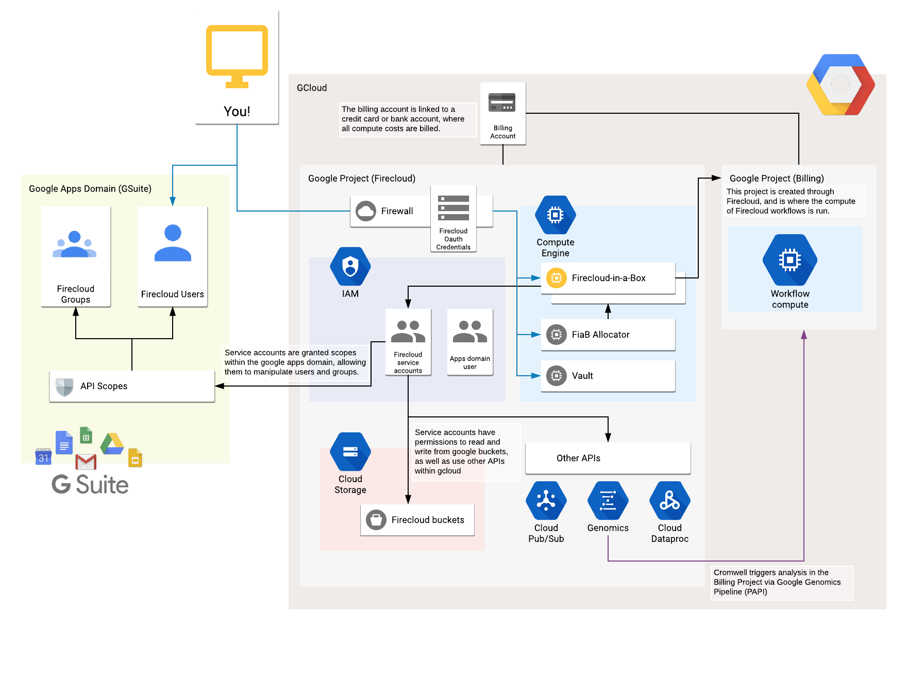
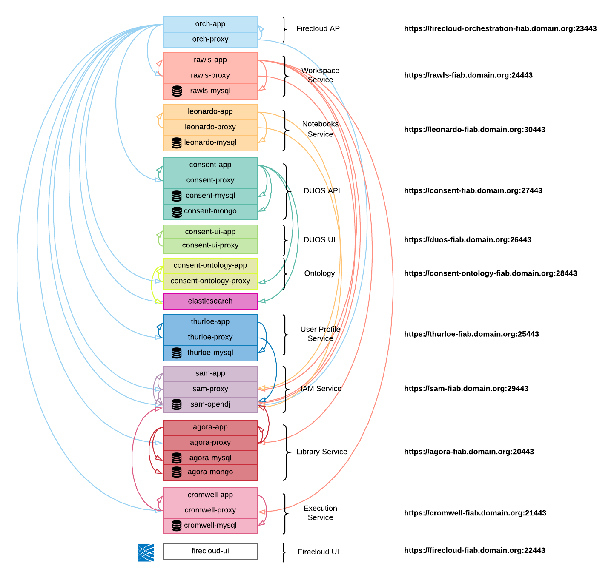

# Using Firecloud-in-a-Box

## Architecture

describe the basic overall architecture here

### Cloud Architecture

explain nuances of gsuite vs gcloud vs fiab

### Docker architecture

explain how the fiab stack works, how to set up etc hosts, and how to access each service api

## Running on multiple VMs
FIAB is not a scalable, production-ready installation. It's useful for development, troubleshooting and testing. In production, Firecloud should be run on multiple machines. 

 1. At this point you should have dockers, docker-composes and conf files. If you open the docker-compose files, you'll see where the confs are injected and other variables. 
 2. Docker-composes link all the containers together with Docker Networking. If you want to run on multiple nodes, you'll have to change the `link:` functions in the docker-compose and change conf files to point to "real" machines. That also means setting up DNS for each "real" machine.
 3. In practice, Broad sets this all up using Terraform. Here are our templates: https://github.com/broadinstitute/terraform-firecloud.  
   * In practice, this requires a bunch of prerequisites including Vault and Puppet. A user can use any Docker-enabled node to run any service that we run. 
   * The user is responsible for their own deployment process of getting conf files, certs, etc onto machines that are going to be mounted into the Dockers via docker-compose.
 6. There's a nuance in GCE in that VMs can't route to other VMs in the same project via their external address. So if serverA wants to talk to serverB, it has to do so through the private IP. That means 2 DNS names for each server (public and private) and the conf files have to point to the appropriate one.
   * In practice: If Rawls wants to talk to Cromwell, it has to use Cromwell-priv address.
   * Most of our services are usually deployed behind Google load-balancers. These face the outside world and provide a routable external address. This means that, in actuality, most of the microservices face the outside world. Cromwell doesn't, though, nor do things like Elastic Search and Mongo, so if those live on individual VMs, machines that talk to those services have to use the Priv address.
   3. This also means that the Apache Proxies that sit in front of each service have to be configured for SERVER_NAME as well as SERVER_NAME_ALIASES. 
     * This is also why we require a wildcard SSL cert -- so that a single cert can service all names.
     * Examples:
     * In the apache conf: https://github.com/broadinstitute/firecloud-develop/blob/dev/base-configs/agora/site.conf.ctmpl#L38
     * In the docker-compose: https://github.com/broadinstitute/firecloud-develop/blob/dev/run-context/live/configs/agora/proxy-compose.yaml.ctmpl#L27
 14. Cromwell "scaling"
   * Cromwell currently has a 1-1 relationship with a MySQL database. That means that if you want to run multiple Cromwells for load reasons, it's a "shard" approach. You can spin up another Cromwell but it won't have a shared database. Once a job is on one Cromwell it stays there in perpetuity.
   * Other than spinning up another Cromwell, rawls has to be told to use it: https://github.com/broadinstitute/firecloud-develop/blob/dev/base-configs/rawls/rawls.conf.ctmpl#L82 . These conf lines show an array full of Cromwells in Live Production environments. 
   * We have a beta going on (rolling into production 6/18) using Internal Google Load balancers and URL maps to have a Master-Read Cromwell scaling. This WILL enable Cromwell to have a single Writer and N readers so that if the Writer is overwhelmed, it won't break most of Firecloud/Rawls.
   * When Cromwell As A Service exists, one of its requirements is to have horizontal scalabiility across the board. The above are all stopgaps until that happens.
 19. Scaling everything else
   * As noted, most of our other functions can be scaled already but putting them behind Google load balancers with multiple instances. These include as of this writing: 
     * agora
     * thurloe
     * Orchestration
     * UI
     * rawls
     * sam
   * Leo has not been tested yet to be a Load Balanced service. We're pretty sure it works but unknown.
   * OpenDJ (part of the Sam suite) has it's own load balancing. It is not to be exposed to the outside world. Unless your load is very large, keep it on the Sam machine.
   * Elastic Search and Mongo have their own scaling/multi-node methodologies.
