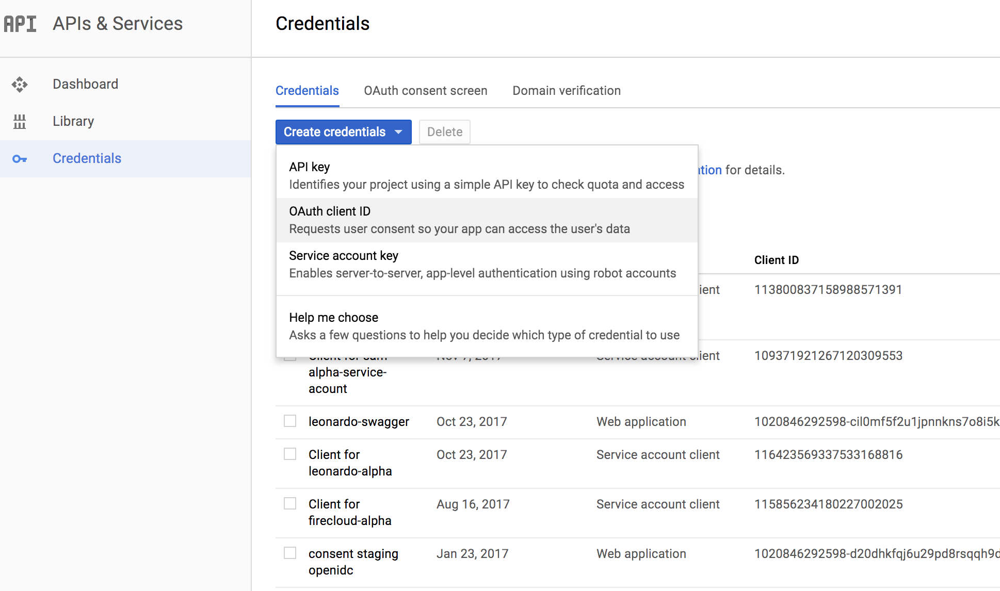

# OAuth Credentials

Oauth credentials need to be manually created in gcloud (due to security vulnerabilities of exposing that API)

## Create credentials in gcloud

In the google console, go to APIs & Services -> Credentials. Click "Create credentials" and select "OAuth client ID"



For application type select "Web application".  Then for each required credential, you will create a name and add the required Authorized JavaScript origins and Authorized redirect URIs.  

Service | Name | Authorized Javascript Origins | Authorized redirect URIs
--- | --- | --- | ---
rawls | Rawls Oauth Credential | https://rawls-fiab.[dns domain] <br> https://rawls-fiab.[dns domain]:24443 https://firecloud-fiab.[dns domain]:22443 | https://rawls-fiab.[dns domain]/oauth2callback <br> https://rawls-fiab.[dns domain]/o2c.html <br> https://rawls-fiab.[dns domain]:24443/oauth2callback <br> https://rawls-fiab.[dns domain]:24443/o2c.html <br> https://firecloud-fiab.[dns domain]:24443/o2c.html <br> https://firecloud-fiab.[dns domain]:24443/oauth2callback
consent | Consent Oauth Credential | https://duos-fiab.[dns domain] <br> https://duos-fiab.[dns domain]:26443 <br> https://consent-fiab.[dns domain] <br> https://consent-fiab.[dns domain]:27443 | https://duos-fiab.[dns domain]/oauth2callback <br> https://duos-fiab.[dns domain]:26443/oauth2callback <br> https://consent-fiab.[dns domain]/oauth2callback <br> https://consent-fiab.[dns domain]:27443/oauth2callback <br> https://consent-fiab.[dns domain]:27443/api <br> https://consent-fiab.[dns domain]:27443/swagger/o2c.html <br> https://consent-fiab.[dns domain]:27443
leonardo | Leonardo Oauth Credential | https://leonardo-fiab.[dns domain] <br> https://leonardo-fiab.[dns domain]:30443 <br> https://firecloud-fiab.[dns domain]:30443 | https://leonardo-fiab.[dns domain]/oauth2callback <br> https://leonardo-fiab.[dns domain]:30443/oauth2callback <br> https://leonardo-fiab.[dns domain]/o2c.html <br> https://leonardo-fiab.[dns domain]:30443/o2c.html <br> https://firecloud-fiab.[dns domain]:30443/o2c.html <br> https://firecloud-fiab.[dns domain]:30443/oauth2callback
common refresh token | Refresh Token Oauth Credential | https://firecloud.[dns domain] <br> https://firecloud-fiab.[dns domain] <br> https://firecloud-fiab.[dns domain]:22443 | https://firecloud-orchestration.[dns domain]/oauth2callback <br> https://firecloud-orchestration.[dns domain]/o2c.html <br> https://firecloud.[dns domain]/ <br> https://firecloud-fiab.[dns domain]/ <br> https://firecloud-fiab.[dns domain]:22443 <br> https://firecloud-fiab.[dns domain]:23443/o2c.html <br> https://firecloud-orchestration-fiab.[dns domain]:23443/o2c.html <br> https://firecloud-fiab.[dns domain]:25443/o2c.html <br> https://firecloud-fiab.[dns domain]:29443/o2c.html


## Store credentials in Vault

In the gcloud API Credentials UI, download the json client secret for each credential.  Pass the absolute path of the json file to the script below.

```$xslt
./oauth/add-oauth-creds-to-vault.sh rawls [path-to-json] [env]
./oauth/add-oauth-creds-to-vault.sh consent [path-to-json] [env]
./oauth/add-oauth-creds-to-vault.sh leonardo [path-to-json] [env]
./oauth/add-oauth-creds-to-vault.sh common [path-to-json] [env]
```

